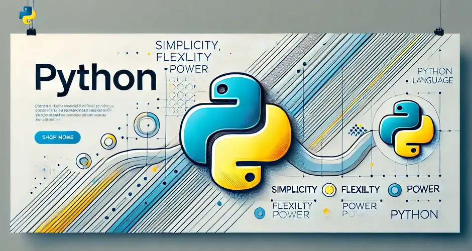

# `Python` 

Es un lenguaje de programación de alto nivel, interpretado y de propósito general. Fue creado por Guido van Rossum y lanzado por primera vez en 1991. Se ha vuelto uno de los lenguajes más populares debido a su simplicidad y legibilidad.

### `Características Principales`

- **_Sintaxis Clara y Legible_**: Python enfatiza la legibilidad del código, lo que permite a los desarrolladores escribir código limpio y mantenible.

- **_Interactividad_**: Puedes ejecutar Python de manera interactiva en un intérprete, lo que facilita la prueba y el desarrollo de pequeños fragmentos de código.

- **_Multiparadigma_**: Soporta varios estilos de programación, incluidos la programación orientada a objetos, la programación funcional y la programación imperativa.

- **_Amplia Biblioteca Estándar_**: Python viene con una rica biblioteca estándar que proporciona herramientas para manipulación de cadenas, acceso a archivos, manejo de excepciones, entre otros.

- **_Portabilidad_**: Python es compatible con múltiples plataformas (Windows, macOS, Linux), lo que permite que los programas escritos en Python se ejecuten en diferentes sistemas operativos sin modificaciones.

- **_Gran Comunidad_**: Cuenta con una comunidad activa y extensa, lo que significa que hay una gran cantidad de recursos, bibliotecas y frameworks disponibles.

### `Usos Comunes`

Python se utiliza en diversas áreas, como:

- **_Desarrollo Web_**: Con frameworks como Django y Flask, se pueden crear aplicaciones web robustas.

- **_Ciencia de Datos y Análisis_**: Herramientas como NumPy, pandas y Matplotlib permiten el análisis y visualización de datos.

- **_Inteligencia Artificial y Aprendizaje Automático_**: Bibliotecas como TensorFlow y scikit-learn facilitan el desarrollo de modelos de IA.

- **_Automatización y Scripts_**: Python es ideal para escribir scripts que automatizan tareas repetitivas.

- **_Desarrollo de Juegos_**: Con bibliotecas como Pygame, puedes crear juegos en 2D.

[**`Tuplas`**](/_09_tuplas.md)
**-**
[**`Ejercicios Tuplas`**](/_10_tuplas_ejercicios.md)
