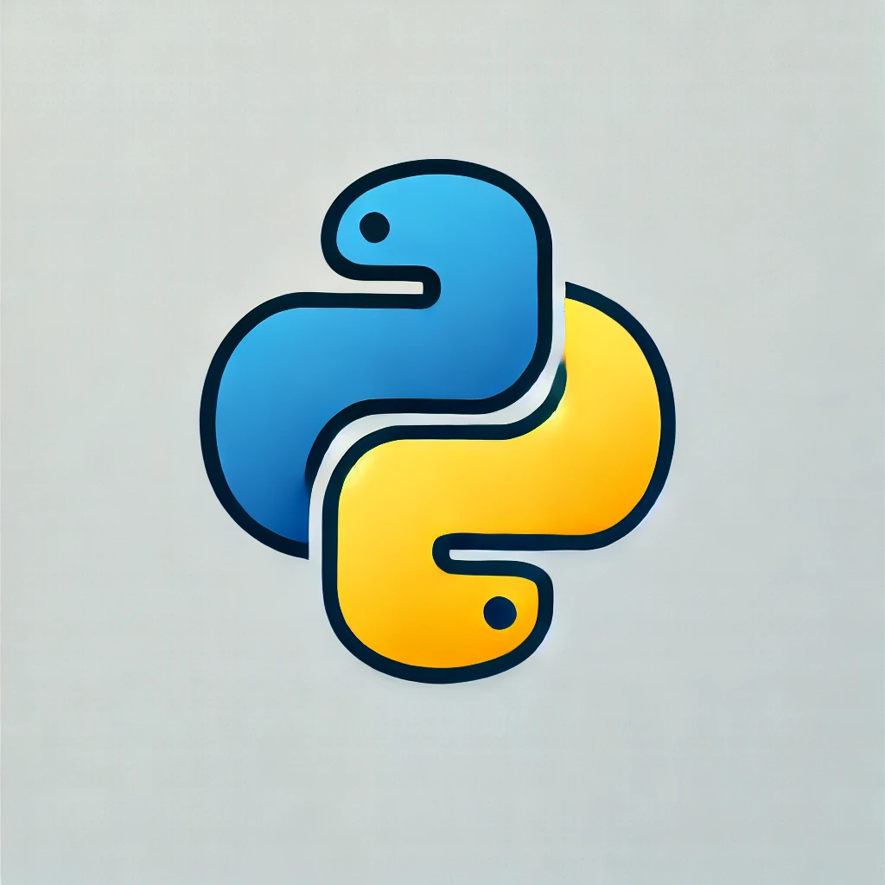

# _`print()`_

`print()` permite controlar cómo se separan los elementos que imprimes mediante el uso de los parámetros sep y end.

---

Parámetro `sep`

El parámetro `sep` en la función `print()` se utiliza para especificar el separador entre los elementos que estás imprimiendo. Por defecto, el separador es un espacio (`' '`), pero puedes cambiarlo a cualquier otro carácter o cadena.

Ejemplo:

```py
print('Python', 'JavaScript', 'Java', sep=' | ')
```

Salida:

```py
Python | JavaScript | Java
```

En este caso, '`|`' se utiliza como separador entre cada cadena.

---

_Parámetro_ **`end`**

El parámetro `end` controla qué se imprime al final de la llamada a `print()`. Por defecto, `print()` termina con un salto de línea `('\n')`, pero puedes cambiarlo a cualquier otro carácter o cadena, o incluso dejarlo vacío.

Ejemplo:

```py
print('Hola', end=' ')
print('Mundo')
```

Salida:

```py
Hola Mundo
```

Aquí, en lugar de un salto de línea, se coloca un espacio al final del primer `print()`, por lo que la siguiente impresión comienza en la misma línea.

---

**`Ejemplo combinado`**

Puedes combinar ambos parámetros para personalizar la salida de tus impresiones:

```py
print('Python', 'JavaScript', 'Java', sep=', ', end='.\n')
```

Salida:

```py
Python, JavaScript, Java.
```

En este ejemplo, `_sep=', '` coloca una coma y un espacio entre los elementos, y `end='.\n'` coloca un punto y luego un salto de línea al final de la impresión.

---

---

## `Formatear cadenas (strings) `

En Python, existen varias formas de formatear cadenas (strings) que facilitan la inserción de variables y expresiones dentro de texto. Formas más comunes:

### 1. **Concatenación**

Puedes concatenar cadenas con el operador `+`.

```python
nombre = "Juan"
edad = 30
mensaje = "Hola, " + nombre + ". Tienes " + str(edad) + " años."
print(mensaje)
```

### 2. **Interpolación usando el operador `%`**

Este método usa un estilo similar al del lenguaje C.

```python
nombre = "Juan"
edad = 30
mensaje = "Hola, %s. Tienes %d años." % (nombre, edad)
print(mensaje)
```

- `%s`: Para strings.
- `%d`: Para enteros.

### 3. **Método `.format()`**

El método `format()` te permite insertar valores en posiciones específicas dentro de una cadena.

```python
nombre = "Juan"
edad = 30
mensaje = "Hola, {}. Tienes {} años.".format(nombre, edad)
print(mensaje)
```

También puedes usar índices o nombres para mayor flexibilidad.

```python
mensaje = "Hola, {0}. Tienes {1} años.".format(nombre, edad)
# O con nombres
mensaje = "Hola, {nombre}. Tienes {edad} años.".format(nombre=nombre, edad=edad)
```

### 4. **f-Strings (Literales de formato)**

A partir de Python 3.6, se introdujeron los f-strings, que permiten incrustar expresiones directamente dentro de las llaves `{}`.

```python
nombre = "Juan"
edad = 30
mensaje = f"Hola, {nombre}. Tienes {edad} años."
print(mensaje)
```

También puedes realizar cálculos dentro de las llaves.

```python
precio = 100.567
mensaje = f"El precio con descuento es {precio * 0.9:.2f} euros."
print(mensaje)
```

El `.2f` especifica que quieres redondear el número a 2 decimales.

### 5. **Template Strings (módulo `string`)**

El módulo `string` proporciona una forma más segura para formatear cadenas, útil cuando se trabaja con datos externos que no deben ser manipulados de manera accidental o maliciosa.

```python
from string import Template

t = Template("Hola, $nombre. Tienes $edad años.")
mensaje = t.substitute(nombre="Juan", edad=30)
print(mensaje)
```

---

---

## Método `find()`

El método find() en Python se utiliza para buscar la posición (índice) de una subcadena dentro de una cadena más grande. Si la subcadena se encuentra, find() devuelve el índice de la primera aparición de dicha subcadena. Si no se encuentra, devuelve -1.

---

## El método `index()`

En Python es muy similar al método `find()`, pero con una diferencia importante: mientras que `find()` devuelve `-1` si no encuentra la subcadena, `index()` **lanza una excepción (`ValueError`)** si la subcadena no se encuentra en la cadena.

### Sintaxis:

```python
cadena.index(subcadena, inicio, fin)
```

### Parámetros:

- **subcadena**: La subcadena que estás buscando en la cadena principal.
- **inicio** (opcional): El índice desde donde se comenzará a buscar. Si no se proporciona, empieza desde el principio.
- **fin** (opcional): El índice donde se terminará la búsqueda. Si no se proporciona, busca hasta el final de la cadena.

### Ejemplos:

1. **Buscar una subcadena**:

   ```python
   texto = "Hola, mundo"
   posicion = texto.index("mundo")
   print(posicion)  # Salida: 6
   ```

   Aquí, el método `index()` devuelve `6`, que es el índice donde comienza la palabra "mundo".

2. **Subcadena no encontrada (lanzará una excepción)**:

   ```python
   texto = "Hola, mundo"
   posicion = texto.index("Python")  # Lanza ValueError
   ```

   A diferencia de `find()`, que devolvería `-1` si no encuentra la subcadena, `index()` lanzará una excepción `ValueError` porque "Python" no está en el texto.

3. **Buscar desde un índice específico**:
   ```python
   texto = "Hola, mundo, bienvenido al mundo"
   posicion = texto.index("mundo", 10)
   print(posicion)  # Salida: 25
   ```
   En este caso, se comienza la búsqueda desde el índice 10 y se encuentra "mundo" en el índice 25.

### Diferencias clave entre `find()` y `index()`:

- `find()` devuelve `-1` si no encuentra la subcadena.
- `index()` lanza una excepción si no encuentra la subcadena.

Si estás seguro de que la subcadena estará presente en la cadena, `index()` puede ser una opción, pero si no lo estás, es mejor usar `find()` para evitar errores.

---

---

# Corchetes `[]`

Se conocen comúnmente como corchetes o brackets en programación. Su uso depende del contexto, pero en muchos lenguajes, como Python y JavaScript, se utilizan para:

Listas o arrays: Para definir o acceder a elementos en una lista o array.

Ejemplo en Python: mi_lista = [1, 2, 3]
Índices: Para acceder a un elemento en una posición específica de una lista, cadena u otro tipo de colección.

Ejemplo en Python: mi_lista[0] accede al primer elemento de la lista.
Slices (corte): Para extraer porciones de una secuencia (como en tu ejemplo anterior).

Ejemplo: cadena[0:5].

## Método `round()`

Si necesitas redondear el valor de una variable `float` directamente (sin formatear la salida), puedes usar la función `round()`:

```py
mi_numero = 3.14159265359
mi_numero_redondeado = round(mi_numero, 2)  # Redondea a 2 decimales
print(mi_numero_redondeado)
```

## _`Listas`_

Una listas en Python es una estructura de datos que permite almacenar múltiples elementos en un solo contenedor o variable. Las listas son _**ordenadas**_, _**cambiales**_ y permiten elementos _**duplicados**_.

### Caracteristicas de las _`Listas`_

1. **Ordenadas**: Los elementos en una lista mantienen el orden en que se aregaron. Se acceden a los elementos usando índices, que empiezan desde 0.

1. **Cambiables**: Puedes modificar los elementos de una lista después de haberla creado. Puedes cambiar, agregar o eliminar elementos en una lista.

1. **Permiten Duplicados**: Las listas pueden contener elementos duplicados. Los elementos en una lista no tienen que ser únicos.

1. **Heterogéneas**: Una lista puede contener elementos de diferentes tipos, como números, cadenas, booleanos, otras listas, etc.

### Sintaxis

Las listas se crean usando cohorchetes **`[]`**, y los elementos se separan por comas. Ejemplo:

```py
my_list = [1, 2, 3, "cuatro", 5.0]
```

### Acceso a los Elementos

Puedo acceder a los elementos de una lista usando índices:

```py
first_element = my_list[0] # Accedo al primer elemento (1)
last_element = my_list[-1] # Accedo al último elemento (5.0)
```

### Modificación de Elementos

Puedes cambiar el valor de un elemento en una lista:

```py
my_list[3] = "Cuatro Modificado"
```

### Métodos Comunes

- `append()`: Agrega un elemento al final de la lista

```py
my_list.append(6)
```


`Quéde en Tiempo: 3:08`

¡Claro! En Python, una **lista** es una estructura de datos que permite almacenar múltiples elementos en un solo contenedor. Las listas son **ordenadas**, **cambiables** y **permiten elementos duplicados**. Aquí tienes una explicación detallada:

### Características de las Listas en Python

1. **Ordenadas**: Los elementos en una lista mantienen el orden en que se agregaron. Puedes acceder a los elementos usando índices, que empiezan desde 0.

2. **Cambiables**: Puedes modificar los elementos de una lista después de haberla creado. Esto significa que puedes cambiar, agregar o eliminar elementos en una lista.

3. **Permiten Duplicados**: Las listas pueden contener elementos duplicados. Los elementos en una lista no tienen que ser únicos.

4. **Heterogéneas**: Una lista puede contener elementos de diferentes tipos, como números, cadenas, booleanos, otras listas, etc.

### Sintaxis

Las listas se crean usando corchetes `[]`, y los elementos se separan por comas. Por ejemplo:

```python
mi_lista = [1, 2, 3, "cuatro", 5.0]
```

### Acceso a los Elementos

Puedes acceder a los elementos de una lista usando índices:

```python
primer_elemento = mi_lista[0]  # Accede al primer elemento (1)
ultimo_elemento = mi_lista[-1] # Accede al último elemento (5.0)
```

### Modificación de Elementos

Puedes cambiar el valor de un elemento en una lista:

```python
mi_lista[3] = "cuatro modificado"
```

### Métodos Comunes

- **`append()`**: Agrega un elemento al final de la lista.
  ```python
  mi_lista.append(6)
  ```

- **`insert()`**: Inserta un elemento en una posición específica.
  ```python
  mi_lista.insert(2, "insertado")
  ```

- **`remove()`**: Elimina la primera ocurrencia de un elemento.
  ```python
  mi_lista.remove("cuatro")
  ```

- **`pop()`**: Elimina y devuelve el elemento en una posición específica (o el último si no se especifica una posición).
  ```python
  ultimo = mi_lista.pop()
  ```

- **`sort()`**: Ordena los elementos de la lista en su lugar.
  ```python
  mi_lista.sort()
  ```

- **`reverse()`**: Invierte el orden de los elementos en la lista.
  ```python
  mi_lista.reverse()
  ```

### Ejemplo Completo

```python
# Crear una lista
frutas = ["manzana", "banana", "cereza"]

# Acceder a un elemento
print(frutas[1])  # Imprime: banana

# Modificar un elemento
frutas[1] = "naranja"

# Agregar un elemento
frutas.append("kiwi")

# Eliminar un elemento
frutas.remove("manzana")

# Mostrar la lista modificada
print(frutas)  # Imprime: ['naranja', 'cereza', 'kiwi']
```

Las listas son muy versátiles y se utilizan frecuentemente en la programación en Python para almacenar y manipular colecciones de datos. ¡Espero que esto te haya aclarado qué son las listas en Python!