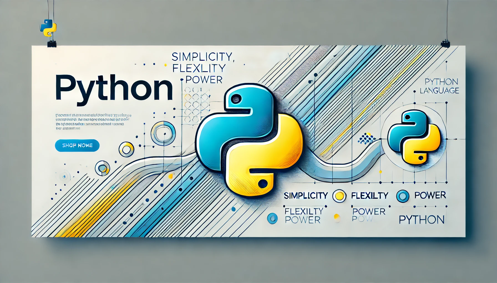

# _`print()`_

`print()` permite controlar cómo se separan los elementos que imprimes mediante el uso de los parámetros sep y end.

---

Parámetro `sep`

El parámetro `sep` en la función `print()` se utiliza para especificar el separador entre los elementos que estás imprimiendo. Por defecto, el separador es un espacio (`' '`), pero puedes cambiarlo a cualquier otro carácter o cadena.

Ejemplo:

```py
print('Python', 'JavaScript', 'Java', sep=' | ')
```

Salida:

```py
Python | JavaScript | Java
```

En este caso, '`|`' se utiliza como separador entre cada cadena.

---

_Parámetro_ **`end`**

El parámetro `end` controla qué se imprime al final de la llamada a `print()`. Por defecto, `print()` termina con un salto de línea `('\n')`, pero puedes cambiarlo a cualquier otro carácter o cadena, o incluso dejarlo vacío.

Ejemplo:

```py
print('Hola', end=' ')
print('Mundo')
```

Salida:

```py
Hola Mundo
```

Aquí, en lugar de un salto de línea, se coloca un espacio al final del primer `print()`, por lo que la siguiente impresión comienza en la misma línea.

---

**`Ejemplo combinado`**

Puedes combinar ambos parámetros para personalizar la salida de tus impresiones:

```py
print('Python', 'JavaScript', 'Java', sep=', ', end='.\n')
```

Salida:

```py
Python, JavaScript, Java.
```

En este ejemplo, `_sep=', '` coloca una coma y un espacio entre los elementos, y `end='.\n'` coloca un punto y luego un salto de línea al final de la impresión.

---

---

## `Formatear cadenas (strings) `

En Python, existen varias formas de formatear cadenas (strings) que facilitan la inserción de variables y expresiones dentro de texto. Formas más comunes:

### 1. **Concatenación**

Puedes concatenar cadenas con el operador `+`.

```python
nombre = "Juan"
edad = 30
mensaje = "Hola, " + nombre + ". Tienes " + str(edad) + " años."
print(mensaje)
```

### 2. **Interpolación usando el operador `%`**

Este método usa un estilo similar al del lenguaje C.

```python
nombre = "Juan"
edad = 30
mensaje = "Hola, %s. Tienes %d años." % (nombre, edad)
print(mensaje)
```

- `%s`: Para strings.
- `%d`: Para enteros.

### 3. **Método `.format()`**

El método `format()` te permite insertar valores en posiciones específicas dentro de una cadena.

```python
nombre = "Juan"
edad = 30
mensaje = "Hola, {}. Tienes {} años.".format(nombre, edad)
print(mensaje)
```

También puedes usar índices o nombres para mayor flexibilidad.

```python
mensaje = "Hola, {0}. Tienes {1} años.".format(nombre, edad)
# O con nombres
mensaje = "Hola, {nombre}. Tienes {edad} años.".format(nombre=nombre, edad=edad)
```

### 4. **f-Strings (Literales de formato)**

A partir de Python 3.6, se introdujeron los f-strings, que permiten incrustar expresiones directamente dentro de las llaves `{}`.

```python
nombre = "Juan"
edad = 30
mensaje = f"Hola, {nombre}. Tienes {edad} años."
print(mensaje)
```

También puedes realizar cálculos dentro de las llaves.

```python
precio = 100.567
mensaje = f"El precio con descuento es {precio * 0.9:.2f} euros."
print(mensaje)
```

El `.2f` especifica que quieres redondear el número a 2 decimales.

### 5. **Template Strings (módulo `string`)**

El módulo `string` proporciona una forma más segura para formatear cadenas, útil cuando se trabaja con datos externos que no deben ser manipulados de manera accidental o maliciosa.

```python
from string import Template

t = Template("Hola, $nombre. Tienes $edad años.")
mensaje = t.substitute(nombre="Juan", edad=30)
print(mensaje)
```

---

---

## Método `find()`

El método find() en Python se utiliza para buscar la posición (índice) de una subcadena dentro de una cadena más grande. Si la subcadena se encuentra, find() devuelve el índice de la primera aparición de dicha subcadena. Si no se encuentra, devuelve -1.

---

## El método `index()`

En Python es muy similar al método `find()`, pero con una diferencia importante: mientras que `find()` devuelve `-1` si no encuentra la subcadena, `index()` **lanza una excepción (`ValueError`)** si la subcadena no se encuentra en la cadena.

### Sintaxis:

```python
cadena.index(subcadena, inicio, fin)
```

### Parámetros:

- **subcadena**: La subcadena que estás buscando en la cadena principal.
- **inicio** (opcional): El índice desde donde se comenzará a buscar. Si no se proporciona, empieza desde el principio.
- **fin** (opcional): El índice donde se terminará la búsqueda. Si no se proporciona, busca hasta el final de la cadena.

### Ejemplos:

1. **Buscar una subcadena**:

   ```python
   texto = "Hola, mundo"
   posicion = texto.index("mundo")
   print(posicion)  # Salida: 6
   ```

   Aquí, el método `index()` devuelve `6`, que es el índice donde comienza la palabra "mundo".

2. **Subcadena no encontrada (lanzará una excepción)**:

   ```python
   texto = "Hola, mundo"
   posicion = texto.index("Python")  # Lanza ValueError
   ```

   A diferencia de `find()`, que devolvería `-1` si no encuentra la subcadena, `index()` lanzará una excepción `ValueError` porque "Python" no está en el texto.

3. **Buscar desde un índice específico**:
   ```python
   texto = "Hola, mundo, bienvenido al mundo"
   posicion = texto.index("mundo", 10)
   print(posicion)  # Salida: 25
   ```
   En este caso, se comienza la búsqueda desde el índice 10 y se encuentra "mundo" en el índice 25.

### Diferencias clave entre `find()` y `index()`:

- `find()` devuelve `-1` si no encuentra la subcadena.
- `index()` lanza una excepción si no encuentra la subcadena.

Si estás seguro de que la subcadena estará presente en la cadena, `index()` puede ser una opción, pero si no lo estás, es mejor usar `find()` para evitar errores.

---

---

# Corchetes `[]`

Se conocen comúnmente como corchetes o brackets en programación. Su uso depende del contexto, pero en muchos lenguajes, como Python y JavaScript, se utilizan para:

Listas o arrays: Para definir o acceder a elementos en una lista o array.

Ejemplo en Python: mi_lista = [1, 2, 3]
Índices: Para acceder a un elemento en una posición específica de una lista, cadena u otro tipo de colección.

Ejemplo en Python: mi_lista[0] accede al primer elemento de la lista.
Slices (corte): Para extraer porciones de una secuencia (como en tu ejemplo anterior).

Ejemplo: cadena[0:5].

## Método `round()`

Si necesitas redondear el valor de una variable `float` directamente (sin formatear la salida), puedes usar la función `round()`:

```py
mi_numero = 3.14159265359
mi_numero_redondeado = round(mi_numero, 2)  # Redondea a 2 decimales
print(mi_numero_redondeado)
```

---

---

## _`Listas`_

Una lista en Python es una estructura de datos que permite almacenar múltiples elementos en un solo contenedor o variable. Las listas son _**ordenadas**_, _**cambiales**_ y permiten elementos _**duplicados**_.

### Caracteristicas de las _`Listas`_

1. **Ordenadas**: Los elementos en una lista mantienen el orden en que se aregaron. Se acceden a los elementos usando índices, que empiezan desde 0.

1. **Cambiables**: Puedes modificar los elementos de una lista después de haberla creado. Puedes cambiar, agregar o eliminar elementos en una lista.

1. **Permiten Duplicados**: Las listas pueden contener elementos duplicados. Los elementos en una lista no tienen que ser únicos.

1. **Heterogéneas**: Una lista puede contener elementos de diferentes tipos, como números, cadenas, booleanos, otras listas, etc.

### Sintaxis

Las listas se crean usando cohorchetes **`[]`**, y los elementos se separan por comas. Ejemplo:

```py
my_list = [1, 2, 3, "four", 5.0]
```

### Acceso a los Elementos

Puedo acceder a los elementos de una lista usando índices:

```py
first_element = my_list[0] # Accedo al primer elemento (1)
last_element = my_list[-1] # Accedo al último elemento (5.0)
```

### Modificación de Elementos

Puedes cambiar el valor de un elemento en una lista:

```py
my_list = [1, 2, 3, "four", 5.0]

my_list[3] = "Four Modified"
print(my_list) # Imprime [1, 2, 3, "Four Modified", 5.0]
```

### Métodos Comunes

- `append()`: Agrega un elemento al final de la lista.

```py
my_list = [1, 2, 3, "four", 5.0]
my_list.append(6)
my_list = [1, 2, 3, "four", 5.0, 6] # Agrega el número "6" al final de la lista.
```

- `insert()`: Inserta un elemento en una posición específica de la lista.

```py
my_list = [1, 2, 3, "four", 5.0]
my_list.insert(3, "Hello Ismael")
my_list = [1, 2, 3, "four", "Hello Ismael", 5.0] # Inserto "Hello Ismael" en la posición 4.
```

- `remove()`: Elimina un elemento específico de una lista.

```py
my_list = [1, 2, 3, "four", 5.0]
my_list.remove(3)
my_list = [1, 2, "four", 5.0] # Eliminó el número "3"
```

- `pop()`: Elimina el índice espedificado( o el último elemento si no se especifica el índice).

```py
lst = ['item1', 'item2']
lst.pop()       # last item
```

## **`slice (rebanado)`**

En Python, puedes usar el método **`insert()`** para agregar un solo elemento en una posición específica, pero si quieres agregar **varios elementos** a una lista en una posición determinada, una buena opción es utilizar el **_slice_ (rebanado)** para insertar una lista de varios elementos en una posición específica.

Aquí te dejo un ejemplo de cómo hacerlo:

### Ejemplo:

```python
# Lista inicial
mi_lista = [1, 2, 3, 7, 8]

# Elementos a agregar
nuevos_elementos = [4, 5, 6]

# Agregar los nuevos elementos en la posición 3 (antes del 7)
mi_lista[3:3] = nuevos_elementos

print(mi_lista)
```

### Resultado:

```python
[1, 2, 3, 4, 5, 6, 7, 8]
```

### Explicación:

- `mi_lista[3:3]` selecciona la **posición 3** (justo antes del número 7) sin eliminar ningún elemento existente.
- Luego, asignamos `nuevos_elementos` en esa posición, lo que inserta los nuevos elementos sin reemplazar los actuales.

De esta forma, puedes agregar varios elementos en la posición específica de la lista.

## `La sintaxis [5:5]`

En Python se refiere a un slice (rebanado) de la lista, y aquí está la explicación:

- full_stack[5:5]:

  - El primer número (5) es el índice de inicio y el segundo (también 5) es el índice final.

  - Este slice no selecciona ningún elemento de la lista, porque el inicio y el final son iguales. Esto significa que estás eligiendo una posición vacía en la lista donde puedes insertar nuevos elementos.

**¿Por qué se repite?**

- Usar el mismo índice en el inicio y el final es una forma de indicar una posición vacía. Así que cuando haces full_stack[5:5] = new_languages, estás insertando los elementos de new_languages en esa posición vacía, sin reemplazar nada.

En resumen, la repetición de los índices es necesaria para indicar que quieres insertar elementos sin eliminar nada existente.

---

## `Slicing (:)`

En la expresión `first_list_countries = countries[:mid_list_countries]`, los dos puntos `:` forman parte de la sintaxis de **slicing** (segmentación) en Python, que se utiliza para extraer una porción de una lista, string o cualquier otra estructura indexada.

En este caso:

- `countries[:mid_list_countries]` significa:
  - **Empieza desde el inicio** de la lista (`countries`) hasta el índice **justo antes de `mid_list_countries`**.

### Detalle de los componentes:

- **Primer valor (vacío antes de `:`)**: Cuando no se especifica un valor antes de los dos puntos, significa "desde el inicio de la lista".
- **Segundo valor (`mid_list_countries`)**: Indica el índice hasta donde se extraerán los elementos, **sin incluir este índice**.

Por ejemplo, si `mid_list_countries = 3`, entonces:

- `countries[:3]` devolverá los elementos desde el índice 0 hasta el índice 2 (los tres primeros elementos de la lista).

### Ejemplo:

```python
countries = ['Afghanistan', 'Albania', 'Algeria', 'Andorra', 'Angola']
mid_list_countries = 3

# Esto retornará los primeros 3 países (índices 0, 1 y 2)
first_list_countries = countries[:mid_list_countries]
print(first_list_countries)
```

Resultado:

```
['Afghanistan', 'Albania', 'Algeria']
```

En resumen, el uso de los dos puntos `:` en slicing permite definir el rango de índices desde el cual se seleccionarán los elementos.

---

## `Método abs()`

En Python devuelve el valor absoluto de un número. El valor absoluto es simplemente la distancia de un número desde el cero en la recta numérica, sin tener en cuenta si es positivo o negativo.

### Sintaxis:

```python
abs(x)
```

- `x` puede ser un número entero, un número flotante o un número complejo.

### Ejemplos:

1. **Números enteros:**

   ```python
   print(abs(-10))  # Salida: 10
   print(abs(5))    # Salida: 5
   ```

2. **Números flotantes:**

   ```python
   print(abs(-3.14))  # Salida: 3.14
   ```

3. **Números complejos:**
   Para números complejos, `abs()` devuelve la magnitud del número (su distancia desde el origen en el plano complejo).
   ```python
   print(abs(3 + 4j))  # Salida: 5.0 (ya que la magnitud de 3+4j es √(3^2 + 4^2) = 5)
   ```

### ¿Cuándo usarlo?

El método `abs()` es útil cuando solo te interesa el valor positivo de un número, como en cálculos de distancias, diferencias o cuando necesitas ignorar el signo.

¡Espero que esto aclare el uso del método `abs()`!

---

## Separar elementos con Símbolo guion `(-)`

Para separar los elementos de una lista por un símbolo específico, como el guion (`-`), puedes usar el método `join()` en Python. Aquí te dejo un ejemplo:

```python
countries = ['China', 'Rusia', 'Estados Unidos', 'Finlandia', 'Suecia', 'Noruega', 'Dinamarca']

# Usar join para separar los elementos con un guion (-)
countries_str = ' - '.join(countries)

print(countries_str)
```

### Explicación:

- `join()` toma una lista y une todos sus elementos en una sola cadena, usando el separador que especifiques. En este caso, el separador es `' - '`.

El resultado será:

```
China - Rusia - Estados Unidos - Finlandia - Suecia - Noruega - Dinamarca
```

##  **`TUPLAS`** 

Una tupla es una estructura de datos en Python que permite almacenar una colección de elementos ordenados e inmutables. Esto significa que, una vez que se crea una tupla, no se pueden modificar, agregar o eliminar elementos de ella.

_Características principales de las tuplas_:

- _Ordenadas_: Los elementos dentro de una tupla tienen un orden definido, lo que significa que puedes acceder a ellos usando índices, igual que en las listas.

- _Inmutables_: A diferencia de las listas, no puedes cambiar el contenido de una tupla una vez creada. No se pueden añadir, eliminar o modificar elementos.

- _Permiten elementos duplicados_: Al igual que las listas, una tupla puede contener elementos duplicados.

- _Heterogéneas_: Pueden contener elementos de diferentes tipos de datos (números, cadenas, listas, etc.).

### `Sintaxis`

Las `tuplas` se definen usando **paréntesis** `()` y separando los elementos con **comas**.

```py
my_tuple = (1, 2, 3, "a", "b", "c") # Forma recomendada, clara y explícita.
```

También es posible crear tuplas sin paréntesis, simplementet separando los elementos con comas, no es una buena práctica, es usada sobre todo en el desempaquetado de variables.

```py
my_tuple = 1, 2, 3 # Válida pero menos clara.
```

### `Longitud`

Usamos el método `len()` para obtener la longitud de una tupla.

```py
my_tuple = (1, 2, 3, "a", "b", "c")
len(my_tuple)
print(len(my_tuple)) # La longitud de la tupla es de: "6" elementos.
```

### `Acceso a elementos`

Es posible acceder a los elementos de una tupla mediante su índice, empezando desde 0, para acceder al primer elemento en la indexación positiva y desde -1 en la indezaxión negativa. El -1 representa el ultimo número de la tupla en la indexación negativa. Dado que esta comienza la indexación desde el final de la tupla.

```py
my_tuple = (10, 20, 30)
print(my_tuple[0]) # Imprime: 10. Representa indexación positiva.
print(my_tuple[-2]) # Imprime: 10. Representa indexación negativa.
```

### `Inmutabilidad`

No se puede cambiar los elementos en una tupla

```py
my_tuple = (10, 20, 30)
my_tuple[1] = 40
print(my_tuple[1]) # Imprime error dado que la tuplas no son modificables.
                   # TypeError: 'tuple' object does not support item assignment
```

### `Cambiar tuplas a listas`

Podemos cambiar de tuplas a listas y de listas a tuplas. La tupla es inmutable, si deseamos modificar una tupla debemos cambiarla por una lista.

```py
my_tuple = (10, 20, 30)
my_tuple = list(my_tuple) # Utilizo el método list() para cambiar la tupla a lista y agregar un elemento nuevo.
my_tuple[1] = 40 # Agregando un nuevo elemento a la lista.
print(my_tuple) # Imprime la lista: [10, 40, 30]
my_tuple = tuple(my_tuple) # Utilizo el método tuple() para convertir nuevamente la lista a tupla.
print(my_tuple) # Imprime la tupla: (10, 40, 30)
```

### `Segmentación de tuplas`

Podemos dividir una subtupla especificando un rango de índice donde comenzar y dónde terminar en la tupla, el valor devuelto será una nueva tupla con los elementos especifícados.

```py
numbers = (1, 2, 3, 4, 5, 6, 7, 8, 9, 10)

first_issues = numbers[:5]
print(first_issues) # Imprime: (1, 2, 3, 4, 5)
second_issues = numbers[5:]
print(second_issues) # Imprime: (6, 7, 8, 9, 10)
numbers_segment = numbers[2:7]
print(numbers_segment) # Imprime: (3, 4, 5, 6, 7)
last_number = numbers[-1]
print(last_number) # Imprime mediante índice negativo el último elemento: 10
```

### `Comprobación de un elemento en una tupla`

Podemos comprobar si un elemento existe o no en una `tupla`, usando el operador de pertenencia `in`, el cuál tiene como función verificar si un elemento está presente en una secuencia (tuplas, listas o cadenas), devolviendo `True` si está y `False` si no está

```py
numbers = (1, 2, 3, 4, 5, 6, 7, 8, 9, 10)
print(11 in numbers) # Imprime "False"
print(4 in numbers) # Imprime "True"
```

### `Concatenación o Unión de tuplas`

Podemos unir dos o más `tuplas` usando el operador `+`

```py
tupla_1 = (1, 2)
tupla_2 = (3, 4, 5, 6)
tupla_concatenada = tupla_1 + tupla_2   # Concatenación de tuplas
print(tupla_concatenada) # Imprime: (1, 2, 3, 4, 5, 6)
```

### `Repetición de elementos en tuplas`

Es posible multiplicar una `tupla` por un número entero para repetir sus elementos

```py
my_tupla = (1, 2) * 3
print(my_tupla) # Imprime: (1, 2, 1, 2, 1, 2)
```

### `Desempaquetado de tuplas`

El desempaquetado de `tuplas`, permite asignar los valores de una `tupla` a variables separadas 

```py
my_tupla = (1, 2, 3, 4)
a, b, c, d = my_tupla
print(a) # Imprime: 1
print(b) # Imprime: 2
print(c) # Imprime: 3
print(d) # Imprime: 4
```

### `Eliminación de tuplas`

No es posible eliminar elementos de una tupla, pero es porible eliminar la tupla usando la instrucción o palabra reservada `del`

```py
my_tupla = (1, 2, 3, 4)
del my_tupla
print(my_tupla) # Imprime: NameError: name 'my_tupla' is not defined
                # 'del' elimina la variable y nos dice que no existe.
```

### `Método` _`count()`_

Este método nos permite devolver las veces que aparece un elemento específico en la tupla. 

```py
my_tupla = (1, 2, 2, 2, 3, 4, 5, 5, 6, 7)

print(my_tupla.count(2)) # Imprime: 3
print(my_tupla.count(4)) # Imprime: 1
print(my_tupla.count(5)) # Imprime: 2
```

### `Método` _`index()`_

Este método devuelve el índice del primer elemento cuyo valor sea igual al que se pasa como argumento

```py
my_tupla = (1, 2, 3, 4)
print(my_tupla.index(4)) # Imprime: 3, este corresponde al elemento 4 el cuál está ubicado en el indice 3. 
```


### `¿Cuándo usar tuplas?`

- Cuando necesitas un conjunto de elementos que no deben cambiar durante la ejecución del programa.

- Cuando quieres un rendimiento optimizado, ya que las tuplas ocupan menos espacio y son más rápidas que las listas para operaciones que no requieren modificaciones.

`Quéde en Tiempo: 4:04`
